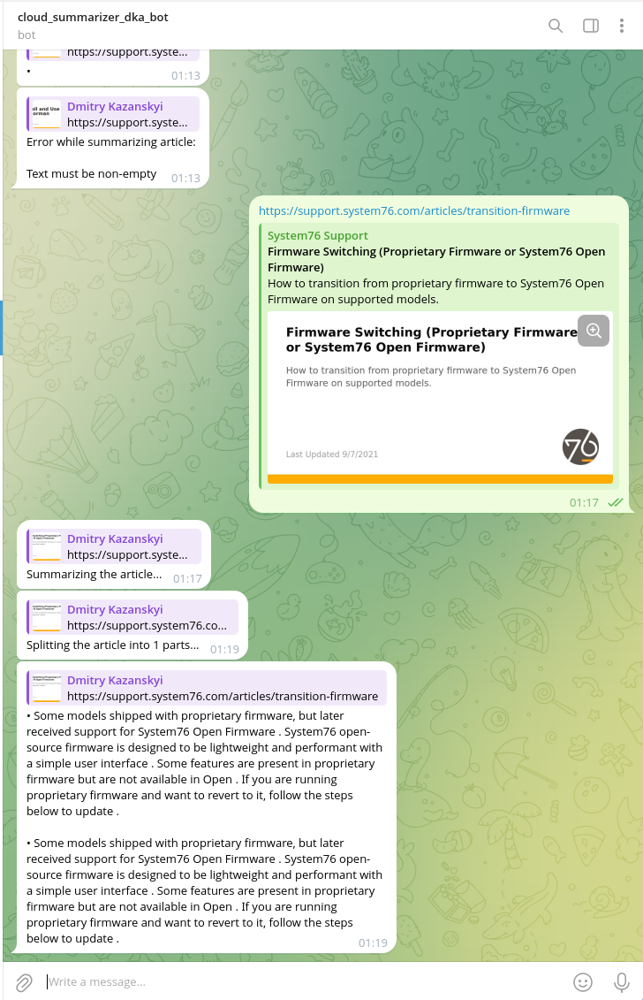
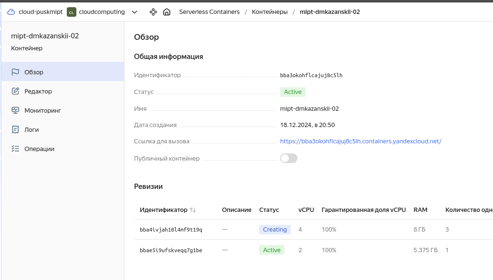
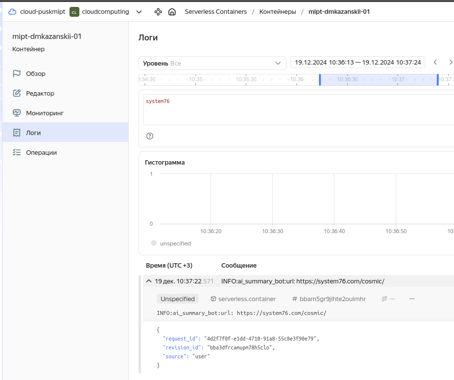
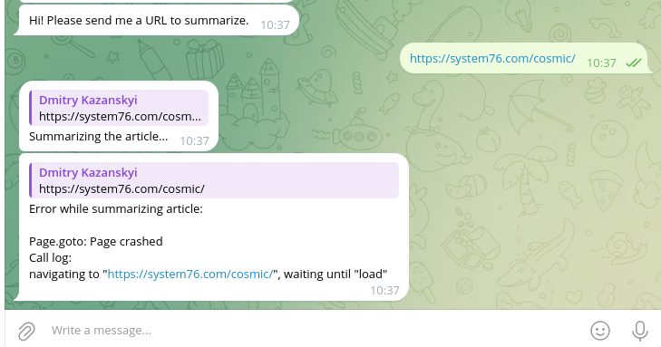

# Дифференцированный зачет. Итоговое задание
> Дедлайн: 08.12.24г.

## Аннотация
Выполненные измененения для запуска телеграм бота:
1. В `scraper.py` для `playwright` использовал `chromium` вместо `firefox`;
2. Для диагностики добавил сообщений в лог;
3. Доработал процесс для определения `num_chunks` в `summarizer.py`;
4. В `Dockerfile` выполнил небольшие изменения.

## Ссылка на репозиторий: [github.com...d-practice](https://github.com/yasenn/cloud-practice)
По инструкции README.md предложенного репозитория выполните шаги, которые считаете нужными для выполнения задачи.

**Цель работы:** развернуть телеграмм-бота-суммаризатора в облачной архитектуре с применением подхода serverless.

## Варианты выполнения:

Запуск на локальном окружении (1 балл)
Запуск на виртуальной машине Я.Облако (3 балла)
Запуск serverless container (6 баллов)

## Что нужно сдать:

Исходный код результирующего проекта (если были внесены правки) - прислать только измененные файлы в виде архива;
Снимки экрана, на которых видны логи бота, успешно обработавшего запрос на суммаризацию и отправившего ответ.

# Environment Variables

To run this project, you will need to add the following environment variables to your .env file

1. `BOT_TOKEN` - Telegram bot token. Get it by creating in [@BotFather](https://t.me/BotFather)
2. `MODEL_NAME` - Summarization model name (options: "sshleifer/distilbart-cnn-12-6", "facebook/bart-large-cnn", "
   facebook/bart-large-xsum"). By default "sshleifer/distilbart-cnn-12-6"
3. `LOG_LEVEL` - Logging level (options: "DEBUG", "INFO", "WARNING", "ERROR", "CRITICAL"). By default "INFO"
4. `FROM_DOCKER` - If the app is running in Docker (options: 1, 0). By default 0

# Results
## Запуск на локальном окружения

Создание докер образа:
```
..Облачные вычисления/cloud-practice$ docker build --build-arg FROM_DOCKER=1 --build-arg BOT_TOKEN="7930383817:AAEjG********GhK115AU2vmFsuKWwkPa0A" -t cr.yandex/crppib76akil44ftoagu/summary-bot:5 .
```

Источник статьи для краткого пересказа: [system76.com transition-firmware](https://support.system76.com/articles/transition-firmware)



```bash
 *  Executing task: docker run --rm -it  cr.yandex/crppib76akil44ftoagu/summary-bot:5 

WARNING:aiogram:Updates were skipped successfully.
INFO:ai_summary_bot:Extracting article...
INFO:ai_summary_bot:url: https://support.system76.com/articles/transition-firmware
INFO:ai_summary_bot:article:

Firmware or System76 Open Firmware)
Some models shipped with proprietary firmware, but later received support for System76 Open Firmware and System76 Open EC. Below is a list of these models:
- Adder WS (addw2)
- Darter Pro (darp6)
- Model shipped wih System76 Open Firmware and proprietary EC. Firmware transition installs System76 Open EC.
- Gazelle (gaze15)
This list may expand in the future as more models are ported.
Differences between System76 Open Firmware and Proprietary Firmware
System76 

INFO:ai_summary_bot:Summarizing article...with MODEL_NAME: sshleifer/distilbart-cnn-12-6
INFO:ai_summary_bot:Loading the summarization model sshleifer/distilbart-cnn-12-6
/usr/local/lib/python3.8/site-packages/huggingface_hub/file_download.py:795: FutureWarning: `resume_download` is deprecated and will be removed in version 1.0.0. Downloads always resume when possible. If you want to force a new download, use `force_download=True`.
  warnings.warn(
config.json: 100%|█████████████████████████████████████████████████████████████████████████████████████████████████████████████████████████████████████████████████████████████████| 1.80k/1.80k [00:00<00:00, 310kB/s]
pytorch_model.bin: 100%|██████████████████████████████████████████████████████████████████████████████████████████████████████████████████████████████████████████████████████████| 1.22G/1.22G [01:45<00:00, 11.6MB/s]
tokenizer_config.json: 100%|████████████████████████████████████████████████████████████████████████████████████████████████████████████████████████████████████████████████████████| 26.0/26.0 [00:00<00:00, 21.5kB/s]
vocab.json: 100%|███████████████████████████████████████████████████████████████████████████████████████████████████████████████████████████████████████████████████████████████████| 899k/899k [00:00<00:00, 2.55MB/s]
merges.txt: 100%|███████████████████████████████████████████████████████████████████████████████████████████████████████████████████████████████████████████████████████████████████| 456k/456k [00:00<00:00, 2.45MB/s]
INFO:ai_summary_bot:Splitting the article into 1 parts
INFO:ai_summary_bot:
content_summaries:
 [' Some models shipped with proprietary firmware, but later received support for System76 Open Firmware . System76 open-source firmware is designed to be lightweight and performant with a simple user interface . Some features are present in proprietary firmware but are not available in Open . If you are running proprietary firmware and want to revert to it, follow the steps below to update .', ' Some models shipped with proprietary firmware, but later received support for System76 Open Firmware . System76 open-source firmware is designed to be lightweight and performant with a simple user interface . Some features are present in proprietary firmware but are not available in Open . If you are running proprietary firmware and want to revert to it, follow the steps below to update .']

INFO:ai_summary_bot:Done summarizing article... summary: • Some models shipped with proprietary firmware, but later received support for System76 Open Firmware . System76 open-source firmware is designed to be lightweight and performant with a simple user interface . Some features are present in proprietary firmware but are not available in Open . If you are running proprietary firmware and want to revert to it, follow the steps below to update .

• Some models shipped with proprietary firmware, but later received support for System76 Open Firmware . System76 open-source firmware is designed to be lightweight and performant with a simple user interface . Some features are present in proprietary firmware but are not available in Open . If you are running proprietary firmware and want to revert to it, follow the steps below to update .


 
INFO:ai_summary_bot:summary: • Some models shipped with proprietary firmware, but later received support for System76 Open Firmware . System76 open-source firmware is designed to be lightweight and performant with a simple user interface . Some features are present in proprietary firmware but are not available in Open . If you are running proprietary firmware and want to revert to it, follow the steps below to update .

• Some models shipped with proprietary firmware, but later received support for System76 Open Firmware . System76 open-source firmware is designed to be lightweight and performant with a simple user interface . Some features are present in proprietary firmware but are not available in Open . If you are running proprietary firmware and want to revert to it, follow the steps below to update .
```

## Запуск serverless container

Создание и размещение образа в реестре `YCloud`:

```
..Облачные вычисления/cloud-practice$ yc container registry get --name mipt-dkazanskii-02 --format=json | jq -r .id
crppib76akil44ftoagu

..Облачные вычисления/cloud-practice$ docker build --build-arg FROM_DOCKER=1 --build-arg BOT_TOKEN="7930383817:AAEjG****vmFsuKWwkPa0A" -t cr.yandex/crppib76akil44ftoagu/summary-bot:yc-sample .

..Облачные вычисления/cloud-practice$ docker push cr.yandex/crppib76akil44ftoagu/summary-bot:yc-sample

The push refers to repository [cr.yandex/crppib76akil44ftoagu/summary-bot]
cf277ebccf74: Pushed 
c3cbbefe95ed: Pushed 
c6ce2588d748: Pushed 
958ef56ec36f: Pushed 
ec5f02b939a3: Pushed 
f3b13dd508c1: Pushed 
58f8bdac3385: Pushed 
139e48a894b9: Pushed 
8cde34bf9146: Pushed 
5f70bf18a086: Layer already exists 
86fee84073f5: Pushed 
327b33af0706: Pushed 
32ee710ca3c7: Layer already exists 
1767e4d52b5a: Layer already exists 
45b98afd69b3: Layer already exists 
2bce433c3a29: Layer already exists 
f91dc7a486d9: Layer already exists 
3e14a6961052: Layer already exists 
d50132f2fe78: Layer already exists 
yc-sample: digest: sha256:03d7b8ae6752c55b7c6df2f05c21fb867c9ec9ea5fae7240413d939050cabed2 size: 4317

```




Лог запроса к Телеграм боту:


Запрос в Телеграм боте:
